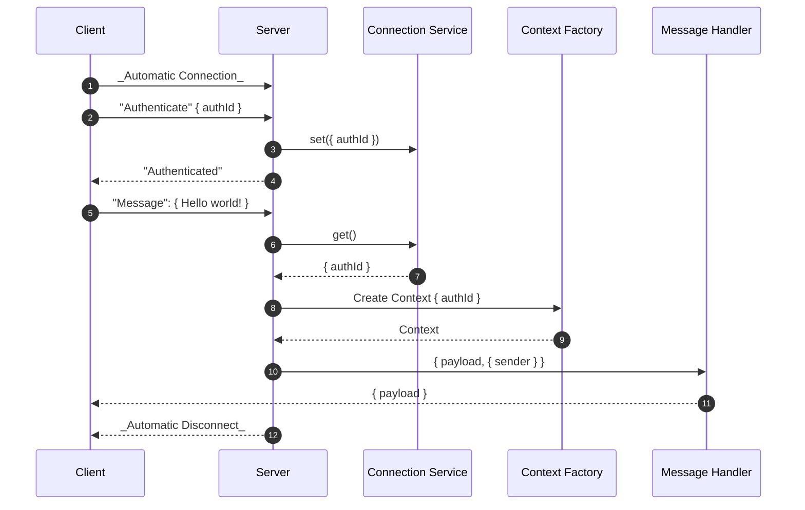

# README

```mermaid
sequenceDiagram
    autonumber
    Client ->> Server: _Automatic Connection_
    Client ->> Server: "Authenticate" { authId }
    Server ->> Connection Service: set({ authId })
    Server -->> Client: "Authenticated"
    Client ->> Server: "Message": { Hello world! }
    Server ->> Connection Service: get()
    Connection Service -->> Server: { authId }
    Server ->> Context Factory: Create Context { authId }
    Context Factory -->> Server: Context
    Server ->> Message Handler: { payload, { sender } }
    Message Handler -->> Client: { payload }
    Server -->> Client: _Automatic Disconnect_
```
