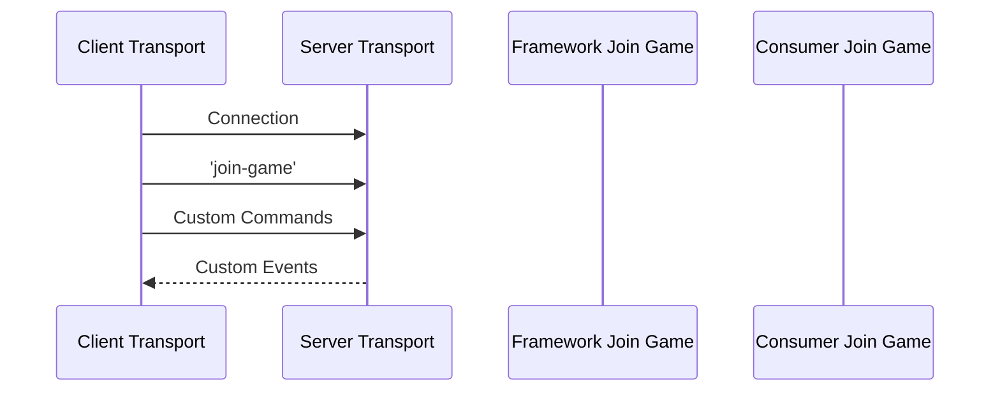

# Diagram

```mermaid

sequenceDiagram

    participant ClientTransport as Client Transport
    participant ServerTransport as Server Transport
    participant FrameworkJoinGame as Framework Join Game
    participant ConsumerJoinGame as Consumer Join Game

    ClientTransport ->> ServerTransport: Connection
    ClientTransport ->> ServerTransport: 'join-game'
    ClientTransport ->> ServerTransport: Custom Commands
    ServerTransport -->> ClientTransport: Custom Events

```
